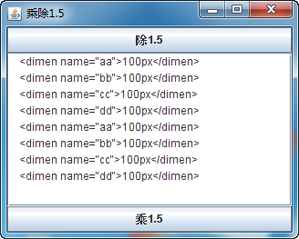

##  android中批量处理dimens.xml的工具

android中批量处理dimens.xml的工具
**取出一段字符中的Int或者Float，乘除1.5倍，生成新的字符串（工具）**

运行效果



 点击“乘1.5”按钮后的运行效果


 下面是java代码

```java
package com.le.test;

import java.awt.BorderLayout;
import java.awt.event.ActionEvent;
import java.awt.event.ActionListener;
import java.util.ArrayList;
import java.util.List;
import java.util.regex.Matcher;
import java.util.regex.Pattern;

import javax.swing.JButton;
import javax.swing.JFrame;
import javax.swing.JScrollPane;
import javax.swing.JTextArea;

public class JHH extends JFrame implements ActionListener {
 JTextArea jta = new JTextArea();
 JScrollPane jsp = new JScrollPane(jta);
 JButton chengButton = new JButton("乘1.5");
 JButton chuButton = new JButton("除1.5");

 public JHH() {
  this.setTitle("乘除1.5");
  this.add(jsp, BorderLayout.CENTER);
  this.add(chengButton, BorderLayout.SOUTH);
  this.add(chuButton, BorderLayout.NORTH);
  this.setBounds(20, 20, 800, 600);
  this.setVisible(true);
  this.setDefaultCloseOperation(JFrame.EXIT_ON_CLOSE);
  chengButton.addActionListener(this);
  chuButton.addActionListener(this);
 }

 public void actionPerformed(ActionEvent e) {
  if (e.getSource() == chengButton) {
   // 取出所有字符串
   String temps = jta.getText();
   // 分行
   String[] tempsa = temps.split("\n");
   // 创建一个数据
   String[] tempsar = new String[tempsa.length];
   for (int i = 0; i < tempsa.length; i++) {
    tempsar[i] = intTo1_5f(tempsa[i]) + "\n";
   }
   temps = "";
   for (String s : tempsar) {
    temps = temps + s;
   }
   jta.setText(temps);
  } else if (e.getSource() == chuButton) {
   String temps = jta.getText();
   String[] tempsa = temps.split("\n");
   String[] tempsar = new String[tempsa.length];
   for (int i = 0; i < tempsa.length; i++) {
    tempsar[i] = intTo0_75f(tempsa[i]) + "\n";
   }
   temps = "";
   for (String s : tempsar) {
    temps = temps + s;
   }
   jta.setText(temps);
  }
 }

 public static void main(String args[]) {
  new JHH();
 }

 private static Pattern pattern = Pattern.compile("\\d+(\\.\\d+)?");

 public static String intTo1_5f(String str) {
  if (str == null || str.equals("")) {
   return str;
  }
  Matcher matcher = pattern.matcher(str);
  List<String> list = new ArrayList();
  while (matcher.find()) {
   list.add(matcher.group());
  }
  String beforeStr = null;
  float afterStr = 0;
  if (list.size() > 0) {
   beforeStr = list.get(list.size() - 1);
   System.out.println("beforeStr: " + beforeStr + "");
   afterStr = 1.5f * Float.parseFloat(beforeStr);
   System.out.println("afterStr: " + afterStr + "");
   int afterInt = 0;
   if (afterStr == Math.floor(afterStr)) {
    afterInt = (int) Math.floor(afterStr);
    str = str.replace(beforeStr, afterInt + "");
   } else if (afterStr == Math.ceil(afterStr)) {
    afterInt = (int) Math.ceil(afterStr);
    str = str.replace(beforeStr, afterInt + "");
   } else {
    str = str.replace(beforeStr, afterStr + "");
   }
  }
  return str;
 }

 public static String intTo0_75f(String str) {
  if (str == null || str.equals("")) {
   return str;
  }
  Matcher matcher = pattern.matcher(str);
  List<String> list = new ArrayList();
  while (matcher.find()) {
   list.add(matcher.group());
  }
  String beforeStr = null;
  float afterStr = 0;
  if (list.size() > 0) {
   beforeStr = list.get(list.size() - 1);
   System.out.println("beforeStr: " + beforeStr + "");
   afterStr = Float.parseFloat(beforeStr) / 1.5f;
   System.out.println("afterStr: " + afterStr + "");
   int afterInt = 0;
   if (afterStr == Math.floor(afterStr)) {
    afterInt = (int) Math.floor(afterStr);
    str = str.replace(beforeStr, afterInt + "");
   } else if (afterStr == Math.ceil(afterStr)) {
    afterInt = (int) Math.ceil(afterStr);
    str = str.replace(beforeStr, afterInt + "");
   } else {
    str = str.replace(beforeStr, afterStr + "");
   }
  }
  return str;
 }

}
```

